# EDA  dos Top 250 Kdramas no MyDramaList 🎬

## ❔ Sobre o projeto

O objetivo deste projeto foi analisar um dataset contendo informações sobre os 250 melhores kdramas ,segundo a <a href = "https://mydramalist.com"> MyDramaList </a> , a fim de identificar as características mais comuns desses dramas e utilizar essas informações para ajudar dois produtores de kdramas com objetivos diferentes: um que busca criar um dos melhores kdramas já vistos (Hardcore), e outro que busca criar um kdrama que venda bem(Money).

Para a mesma foi utilizado o dataset disponível no Kaggle.

Clique <a href  = "https://www.kaggle.com/datasets/ahbab911/top-250-korean-dramas-kdrama-dataset" >aqui</a> caso queira acessá-lo. 

Vamos então ver quais foram os principais destaques e as conclusões dessa análise!

## 📊 Análise do Dataset 

Considerando **maioria = >50%.**

Vamos destacar as **caracteristicas mais comums** dos **top 250 kdramas**:

 **O rating mediano  é de 8.5** ⭐
<table><tr>
<td> 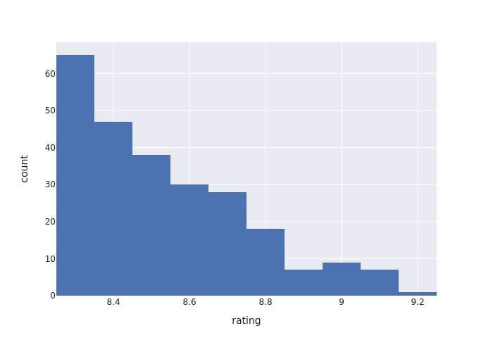 </td>
<td> 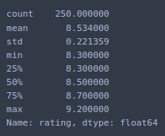 </td>
</tr></table>

 **A restrição de idade mais comum é 15+** 📛

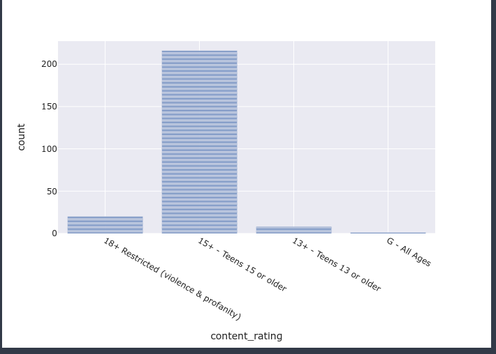

 **A maioria desses kdramas possui entre 16 e 20 episódios** 📺

<td> 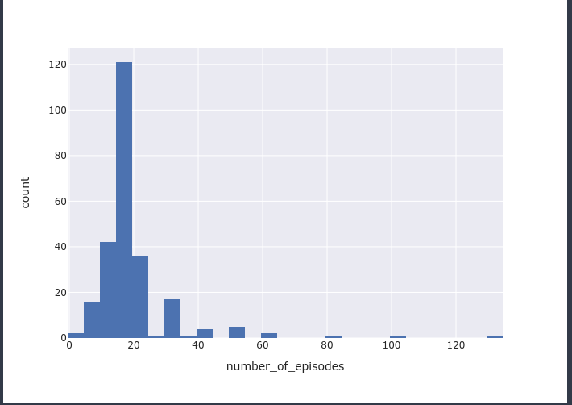 </td>
<td> 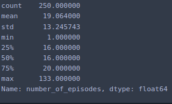 </td>

**A maior parte desses kdramas possui uma duração de episódio de 60 a 70 minutos** ⏱️ 

<td> 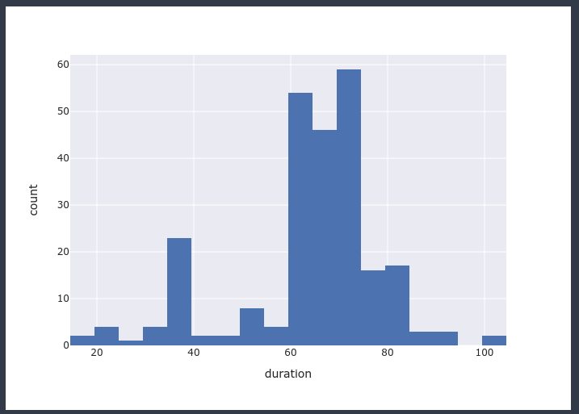 </td>
<td> 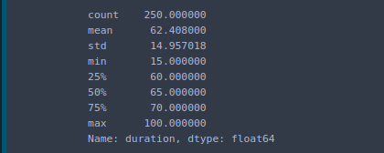 </td>

**A maioria desses kdramas vai ao ar 2 vezes por semana.** 📅 

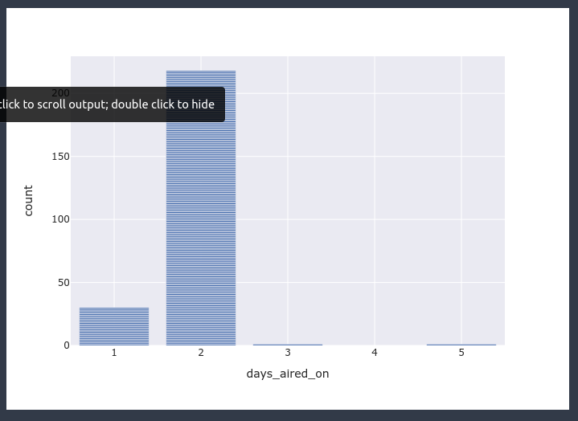

 **Os dias mais comuns para que os kdramas vão ao ar é de Sábado e Quarta(Não combinados).** 📅

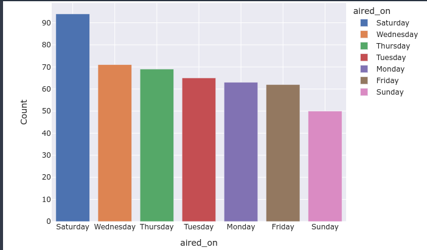

 **Os top 5 generos mais comuns entre os kdramas são: Romance, Drama, Comédia, Mistério e Suspense ( Do mais comum para o menos)** 🎭

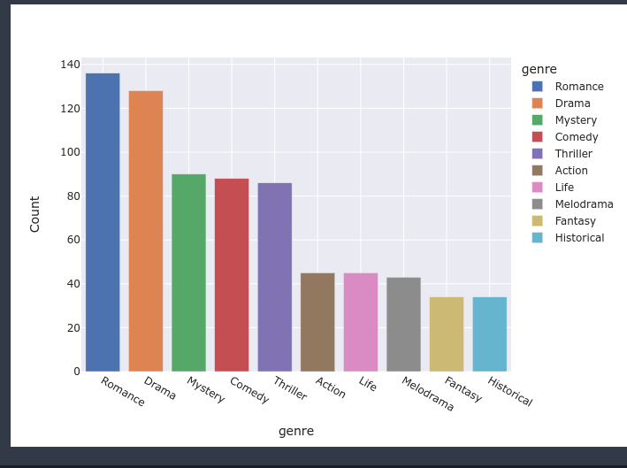

Além disso, foi possível observar que aparentemente nenhuma dessas variáveis parece ter um efeito significativo no rating, com exceção da restrição de idade. Foi possível notar que, **à medida que a restrição de idade diminui, o rating parece subir (por exemplo, 18+ tem um rating mediano maior do que 15+)**, apesar da grande diferença de N.

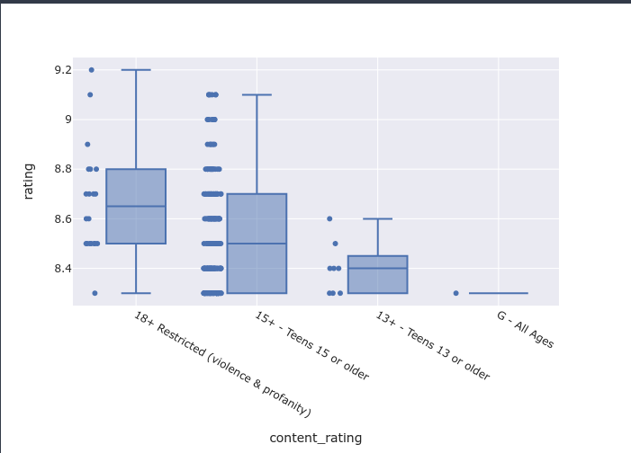

## 💡 Sugestões para os Produtores

Antes de falarmos sobre os produtores, é importante mencionar que, como apenas as análises bivariadas com o rating não foram suficientes, decidi olhar as relações com a restrição de idade para tomar algumas decisões, já que aparentemente ela estava relacionada com o rating.

### 💰 Produtor "Money"

Para atingir seu objetivo de criar um kdrama que venda bem, o produtor "Money" pode utilizar kdramas de referência com as seguintes características:

    Rating: Pelo menos 8.3;
    Restrição de idade: 15+;
    Número de episódios: Até 16 ou entre 16 e 20 episódios;
    Duração do episódio: Entre 60 e 65 minutos ou mais que 70 minutos;
    Número de Dias: 2 vezes por semana;
    Dias: Sábado e domingo;
    Gênero: Escolher algo do top 5 (Drama, Romance, Mistério, Suspense ou Comédia).

Alguns exemplos de kdramas com essas características são "Flower of Evil" (#2), "My Mister" (#5) e "Prison Playbook" (#8).

### 💪 Produtor "Hardcore"

Para atingir seu objetivo de criar um dos melhores kdramas já vistos, o produtor "Hardcore" deve buscar produzir um kdrama 18+, que permite mais liberdade de conteúdo, e que possua as seguintes características:

    Rating: Pelo menos acima 8.5, preferencialmente 8.7;
    Restrição de idade: 18+;
    Número de episódios: Até 16 episódios;
    Duração do episódio: Até 60 minutos;
    Número de dias: 1 vez por semana;
    Dias: Sexta-feira;
    Gênero: Drama e suspense são ótimas escolhas.
    
Alguns exemplos de kdramas com essas características: **Move to Heaven(#1), Weak Hero Class 1 (#7), Kingdom: Season 2 (#20)**
